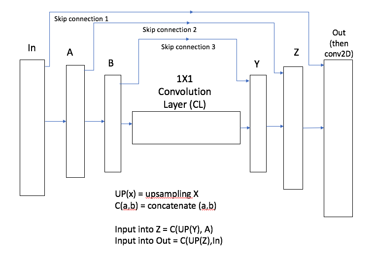
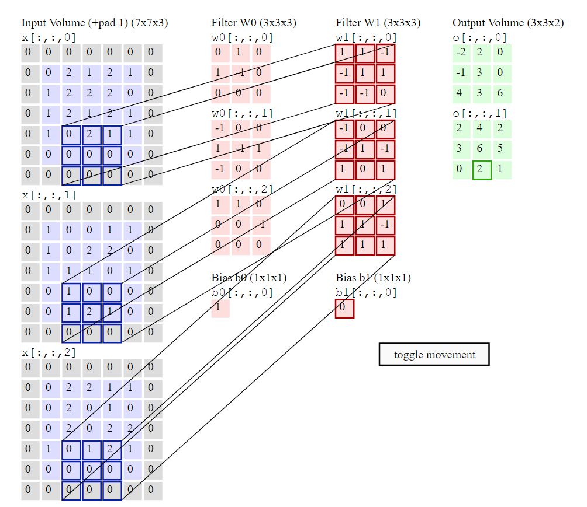
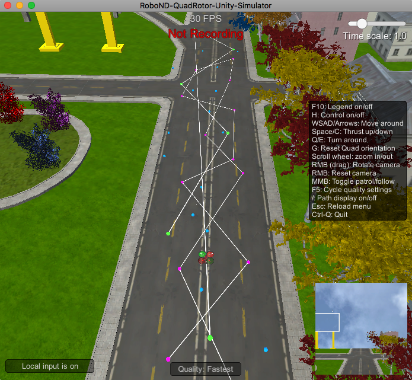
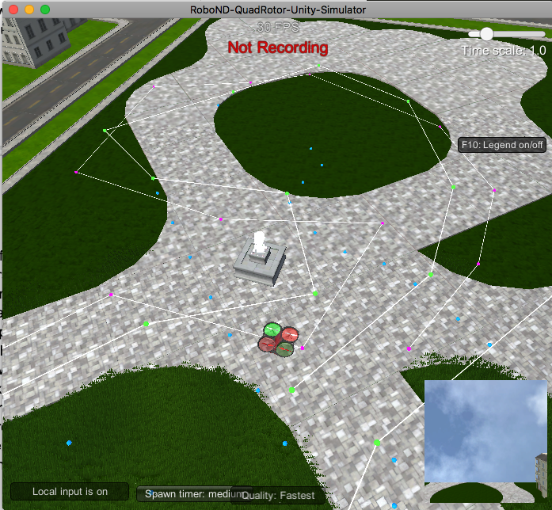

# Project: Follow Me

This project is on deep learning. In this project, a neural network is trained to identify and track a target (a hero in red) in the simulator.

[image_0]: ./docs/misc/sim_screenshot.png
![alt text][image_0] 

Video: [Video](https://youtu.be/Aws5YRif7us)

Notebook: [Jupyter notebook](./model_training.html)
	learning_rate = 0.005
	batch_size = 40
	num_epochs = 20
	steps_per_epoch = 100
	validation_steps = 50
	workers = 2

Notebook2: [Jupyter notebook](./model_training2.html)
	learning_rate = 0.005
	batch_size = 50
	num_epochs = 300
	steps_per_epoch = 100
	validation_steps = 50
	workers = 2
	

## Network Architecture
The model structure used is a 5 layer fully convolutional network model. It has 2 encoders, 1x1 convolution layer and 2 decoders. A fully convolutional model is used instead of a fully connected layer as fully connected layer does not retain any spatial information. As explained in the lectures, while doing convolution they preserve spatial information throughout the entire network. 

### Updates
===============

The same architecture can be used for different objects, i.e. animals, vehicles etc. That's the power of deep learning, training and learning, the network would extract out the features based on the data that it has been trained on. As the model has been trained for the hero specifically, it would need to be retrained to be able to pick up different objects. Some objects may require a more complex structure, but it would be on a per basis, there is probably no one size fits all.

=================

#### Encoder
Separable convolution is used for the encoders. Separable convolutions is a technique that reduces the number of parameters needed, thus increasing efficiency for the encoder network. It requires less parameters, making it more efficient and reducing runtime performance.
In the encoding layers, features of images are extracted, where the simple patterns are found initially and gets refined to understanding complex structure (shapes, person, animal) as it traverse deeper into each layer. 
For this project, the first encoder outputs a depth of 32 from 3 (input), and the second encoder outputs a depth of 64.

#### 1x1 Convolution layer
This layer extracts features from the images before passing it onto the decoder and retaining spatial information. It also helps to reduce the dimensionality of the layer, where  fully connected layer would result in the same number of features, and also in tensor flow feeding a convolutional layer into a fully conencted layer requires flattening (2D tensor). Thus a convolutional layer is more suited than a fully connected layer as we would like spatial information to be retained. 
Also a 1x1 convolutional layer is used with a filter size of 128, ensuring the kernel size is 1 and stride of 1. Initially I did not set the kernel size (it defaults to 3), it results a significantly higher training time as opposed to using a kernel size 1, 

#### Decoder
The decoder does bilinear sampling, where it takes the input and first layer as inputs (for different layers through skip connections). Skip connection connects the output of one layer to a non-adjacent layer, i.e. input to last layer of decoder. 
A transponsed convolution is a reserver convolution in which the forward and backward passes are swapped. The decoder upsample the previous layer to a set dimension and concatenate to a previous layer frm the encoder (refer to image above), followed by passing through 2 separable convolution layers. 

#### Filters
The kernel_size and strides of the filters used determine the determine the dimensionality of the output. This is taken from http://cs231n.github.io/convolutional-networks/. It gives a rough explanation on how the size and stride work together to form the output, together with the weight and bias.

## Hyperparameters

The following hyperparameters are used. 

	learning_rate = 0.005
	batch_size = 40
	num_epochs = 20
	steps_per_epoch = 100
	validation_steps = 50
	workers = 2

There were chosen via trial and errors. The different scenarios outlining the different hyperparameters are shown at the end of this document, with the relevant scores.

The final score with this parameters with the network model above is 0.435272737349, where the final score is based of this equation: average_IoU*(n_true_positive/(n_true_positive+n_false_positive+n_false_negative)).

### Learning rate

Through the different scenarios tested, it can be shown that the learning rate of 0.005 is slightly better than 0.01, where it was only a 0.02 improvement. However this was chosen as it does not seem to impact training time. 

### Batch size and steps

The batch size and steps per epoch were played around, first it was tried with having the total (batch size * steps) to be more than the total available training data, then tried with total being way less. The total training data I have was 6000, and a total (batch_size*steps) ranging from 3200-4000 seems to produce a satisfactory result. Using a steps_per_epoch of 80 and 100 only causes an extra of 5 seconds, however the accuracy didn't seem to improve, so 80 was taken, as it reduces training time. 

### Epochs

The epochs was a tricky one. I tried using 20 and 40 however there were times 40 causes an overfit, where the graph showed a weird spike at the end of the 40 epoch. It seems like an epoch of 40 would cause overfitting in some cases, in those scenarios, the accuracy would drop.

## Training and validation data
More training data were added to increase the training accuracy. There were different scenarions taken into account:
1. Hero in a dense area, where there are other people and can be mistaken for the hero
2. Different angles of the hero, the hero would be zigzagging
3. Some overlapping between the patrol area and hero walking area

## Future enhancements
1. Better training and validation data plays an important role in getting a more accurate model. It can be shown in my experiments where less training model can cause nearly a 0.1 decrease in accuracy, and by doubling the number the accuracy went straight up to above 0.4 without tuning much of the hyper parameters. A good training data that covers different scenarios are also important, i.e cases where the hero zigzags, or the hero is far away, or in a dense crowd. 
2. Trying out more different combinations of encoding/decoding layer. I have tried by increasing one layer, but this seems to increase my training time significantly (AWS is not cooperating sometimes), sometimes by 10 times. 
3. It may also be good to explore other techniques explained in the lecture such as dropout and pooling. 
4. It would be good to be able to try out much bigger epochs, i.e. 50 - 100 and see whether overall the data becomes overfitted or there might be a sweet spot. However the training time is too long for this cases.
5. For the same hyperparameters, running it multiple times can result in different final score. This might be due to the sample evaluation data that has a bias, or the training data that were chosen somehow tallies well with the sample evaluation data. It would be good to explore this corelation between sample evaluation data and training data

## Scenarios

There are different hyperparameters that can be used to obtain different results. With a variety of other scenarios: training data etc.

#### Scenario 1
The default training and validation data that were provided were used for training. There were about 4000 data for training and 1000 data for validation. The following params has been used:

	learning_rate = 0.01
	batch_size = 50
	num_epochs = 20
	steps_per_epoch = 50
	validation_steps = 50
	workers = 2

With the score of 0.3889

#### Scenario 2
A new training and validation data that was self trained were used for training. There were about 2000 data for training and 1000 data for validation. The following params has been used.

	learning_rate = 0.005
	batch_size = 50
	num_epochs = 20
	steps_per_epoch = 80
	validation_steps = 50
	workers = 2

With the score of 0.0354653

There is a signicant drop in result. This might be due to poor quality training data, or bad batch_size/steps_per_epoch. Also note in this case, the total number (batch_size*steps_per_epochs = 4000) is higher than the total number of training data (2000). 

#### Scenario 3
A new training and validation data that was self trained were used for training. There were about 2000 data for training and 1000 data for validation. The following params has been used. With half the learning rate.

	learning_rate = 0.01
	batch_size = 50
	num_epochs = 20
	steps_per_epoch = 80
	validation_steps = 50
	workers = 2

With the score of 0.1348
Comparing the learning rate (double the scenario 2), the learning rate has doubled, the final score has risen significantly. 

#### Scenario 4
A new training and validation data that was self trained were used for training. There were about 2000 data for training and 1000 data for validation. The following params has been used. The total number of steps has halved to ensure that the same data is not trained twice.

	learning_rate = 0.01
	batch_size = 50
	num_epochs = 20
	steps_per_epoch = 50
	validation_steps = 50
	workers = 2

With the score of 0.106
The steps of per epoch was nearly halved. There is a drop in the score as it meant probably lack of total training as some of the training data was not trained. The step_per_epoch should be approximately `total_sample_num/batch_size`. If it's too large, there are some pictures are used over one time for one epoch, if it's too small, some figures didn't be used in one epoch

#### Scenario 5
A new training and validation data that was self trained were used for training. There were about 2000 data for training and 1000 data for validation. The following params has been used. The following params has been used. The number of epochs doubled.

	learning_rate = 0.01
	batch_size = 50
	num_epochs = 40
	steps_per_epoch = 50
	validation_steps = 50
	workers = 2

With the score of 0.091006864897
As the smaller steps needs more epochs to train, to ensure most data has been trained at least once. However as it trains further, there is an odd spike. There is a drop in the result, which probably meant the data is overtrained.

#### Scenario 6
Training and validation data are combined with the sample default and self trained to increase the number of training data. There were about 6000 data for training and 2000 data for validation. 

	learning_rate = 0.01
	batch_size = 40
	num_epochs = 40
	steps_per_epoch = 50
	validation_steps = 50
	workers = 2

With the score of 0.4289
A better training set definitely increased the score.

#### Scenario 7
Training and validation data are combined with the sample default and self trained to increase the number of training data. There were about 6000 data for training and 2000 data for validation. 

	learning_rate = 0.01
	batch_size = 40
	num_epochs = 20
	steps_per_epoch = 80
	validation_steps = 50
	workers = 2

With the score of 0.4538235
Playing around with the steps per epoch, to ensure most of the training data has been trained by the model. An increase of steps per epoch has a slight increment in the final score.

#### Scenario 8
Training and validation data are combined with the sample default and self trained to increase the number of training data. There were about 6000 data for training and 2000 data for validation. 

	learning_rate = 0.01
	batch_size = 40
	num_epochs = 40
	steps_per_epoch = 80
	validation_steps = 50
	workers = 2

With the score of 0.439556
Increasing the number of epochs seems to have a drop in final score. This may indicate that the model may the overfitted. Thus a drop in score.

#### Scenario 9
Training and validation data are combined with the sample default and self trained to increase the number of training data. There were about 6000 data for training and 2000 data for validation. 

	learning_rate = 0.005
	batch_size = 40
	num_epochs = 20
	steps_per_epoch = 80
	validation_steps = 50
	workers = 2

With the score of 0.4647
Halving the learning rate seems to work better.

#### Scenario 10
Training and validation data are combined with the sample default and self trained to increase the number of training data. There were about 6000 data for training and 2000 data for validation. 

	learning_rate = 0.005
	batch_size = 40
	num_epochs = 40
	steps_per_epoch = 80
	validation_steps = 50
	workers = 2

With the score of 0.45320

#### Scenario 11
Training and validation data are combined with the sample default and self trained to increase the number of training data. There were about 6000 data for training and 2000 data for validation. 

	learning_rate = 0.005
	batch_size = 40
	num_epochs = 20
	steps_per_epoch = 100
	validation_steps = 50
	workers = 2

With the score of 0.46090

#### Scenario 12
Training and validation data are combined with the sample default and self trained to increase the number of training data. There were about 6000 data for training and 2000 data for validation. 
Adding another layer for encoding and decoding. It increases training time (slightly)

	learning_rate = 0.005
	batch_size = 40
	num_epochs = 20
	steps_per_epoch = 80
	validation_steps = 50
	workers = 2

With the score of 0.388

#### Scenario 13
Training and validation data are combined with the sample default and self trained to increase the number of training data. There were about 6000 data for training and 2000 data for validation. 
Adding another layer for encoding and decoding ( 3 each in total). And the convolution layer in the middle would have double the amount compared to last encoder.

	learning_rate = 0.005
	batch_size = 40
	num_epochs = 20
	steps_per_epoch = 80
	validation_steps = 50
	workers = 2

With the score of 0.303
The score has dropped, and this is due to an increase in encoding/decoding layer. This may be due to overfitting.

